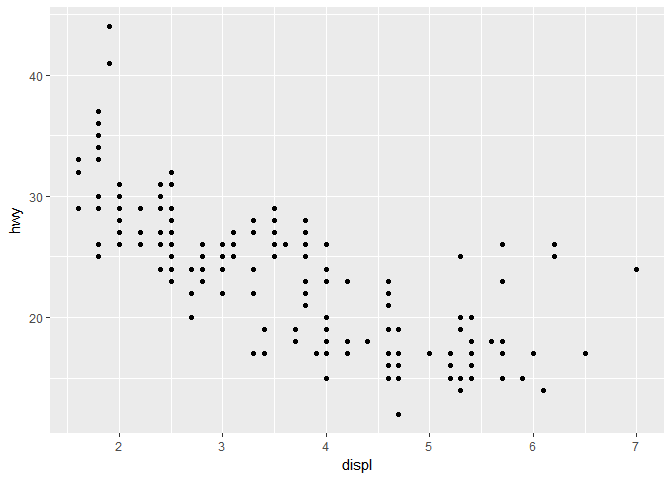
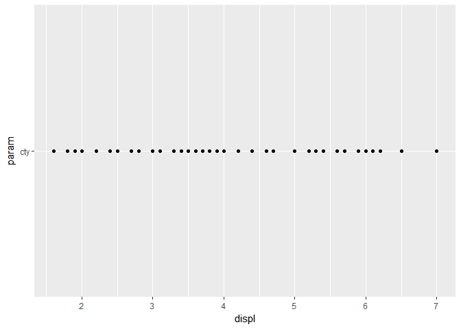
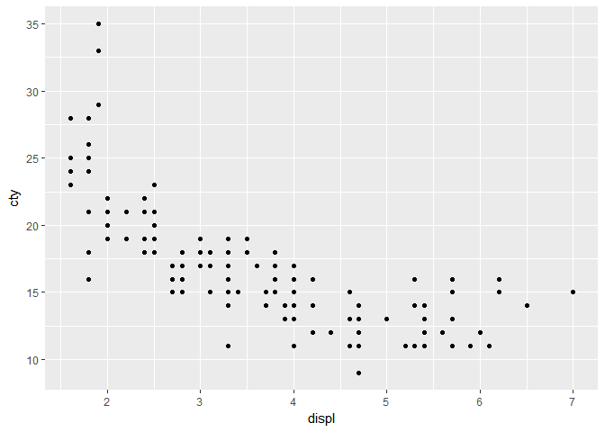

# Parameterized ggplots
Michael Ingrisch  
March 31, 2017  
## Problem

I was always wondering how exactly ggplot resolves the column names that you provide e.g. in aesthetic mappings.
This became a problem in the moment in which I wanted to wrap a ggplot call into a function, in order to quickly plot several columns of a complex dataset. Here, I reproduce this issue in a simple example.
We are working in the tidyverse and use the built-in mpg dataframe to keep things simple:

```r
library(tidyverse)
head(mpg)
```

```
## # A tibble: 6 × 11
##   manufacturer model displ  year   cyl      trans   drv   cty   hwy    fl
##          <chr> <chr> <dbl> <int> <int>      <chr> <chr> <int> <int> <chr>
## 1         audi    a4   1.8  1999     4   auto(l5)     f    18    29     p
## 2         audi    a4   1.8  1999     4 manual(m5)     f    21    29     p
## 3         audi    a4   2.0  2008     4 manual(m6)     f    20    31     p
## 4         audi    a4   2.0  2008     4   auto(av)     f    21    30     p
## 5         audi    a4   2.8  1999     6   auto(l5)     f    16    26     p
## 6         audi    a4   2.8  1999     6 manual(m5)     f    18    26     p
## # ... with 1 more variables: class <chr>
```
This is a very simple function that wraps around a ggplot call and returns a plot:


```r
plot.data <- function(data){
  g <- ggplot(data, aes(x = displ, y=hwy))+
    geom_point()
  g
}
plot.data(mpg)
```

<!-- -->

Problems begin to arise once we try to pass a variable that is supposed to determine the y aesthetics - e.g. cty. This does not work, since `cty`is not known when our function is called. Of course, we can pass the _name_ of the column as a string - but then, ggplot would try to map a single value, the string, on the y axis:


```r
plot.data.param <- function(data, param){
  g <- ggplot(data, aes(x = displ, y=param))+
    geom_point()
  g
}
plot.data.param(mpg, 'cty')
```

<!-- -->


## The solution: aes_string

Therefore, we need to find a way to pass a string variable to the ggplot aesthetics. The solution is provided by aes_string:


```r
plot.data.aes.string <- function(data, param){
  str(param)
  g <- ggplot(data, aes_string(x = 'displ',y= param))+
    geom_point()
  g
}
plot.data.aes.string(mpg, 'hwy')
```

```
##  chr "hwy"
```

<!-- -->

```r
plot.data.aes.string(mpg, 'cty')
```

```
##  chr "cty"
```

<!-- -->

Problem solved.


